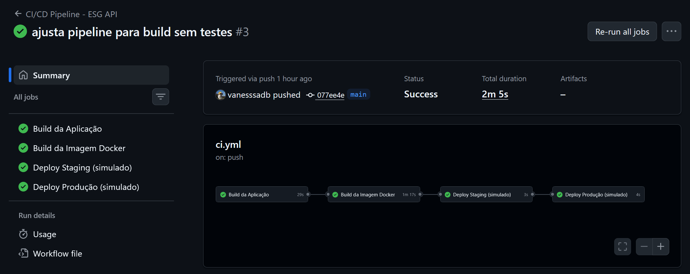
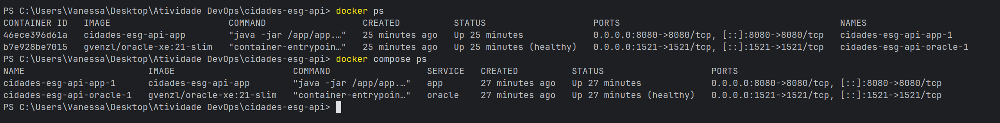
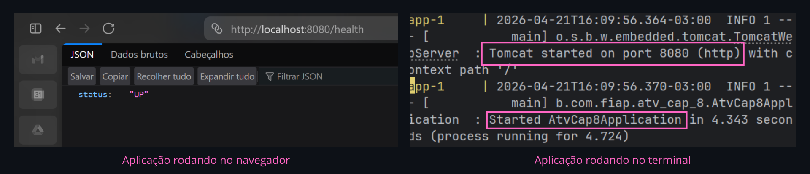
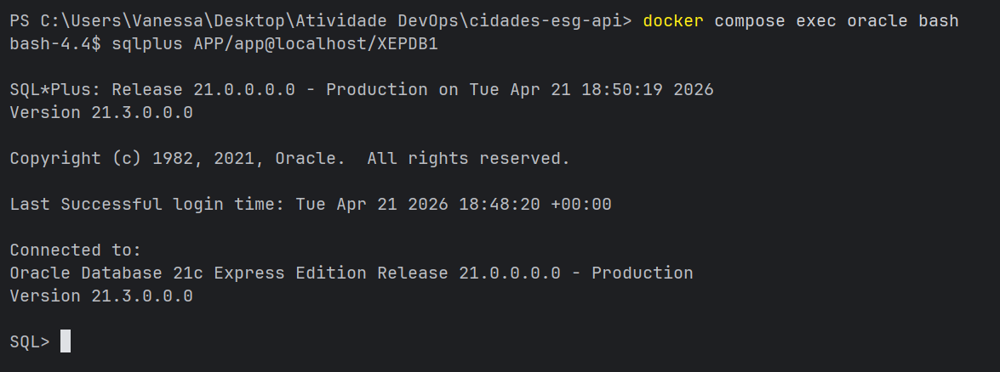

# Projeto - Cidades ESG Inteligentes

## 👩‍💻 Integrante

Vanessa Dourado Bernardes

---

## 📌 Descrição do Projeto

Este projeto consiste em uma API REST desenvolvida em Java com Spring Boot, voltada para o contexto ESG (Environmental, Social and Governance), com foco no gerenciamento de emissões e indicadores ambientais.

A aplicação foi adaptada para um cenário DevOps completo, incluindo pipeline CI/CD, containerização com Docker e orquestração com Docker Compose.

---

## 🚀 Como executar localmente com Docker

### Pré-requisitos

* Docker Desktop
* Git

### Passos

```bash
git clone https://github.com/vanesssadb/esg-api-devops.git
cd esg-api-devops
docker compose up --build
```

A aplicação estará disponível em:

```
http://localhost:8080
```

⚠️ Observação: a API utiliza autenticação JWT, portanto o acesso direto pode retornar HTTP 403 (esperado).

---

## 🔁 Pipeline CI/CD

O projeto utiliza GitHub Actions para automação do ciclo de vida da aplicação.

### Etapas do pipeline:

* Checkout do código
* Configuração do Java 21
* Build com Maven
* Build da imagem Docker
* Deploy simulado em staging
* Deploy simulado em produção

---

## 🐳 Containerização

A aplicação foi containerizada utilizando Docker com estratégia de multi-stage build, garantindo melhor organização e menor tamanho da imagem final.

---

## ⚙️ Orquestração

Foi utilizado Docker Compose para subir:

* API Spring Boot
* Banco de dados Oracle XE
* Volume persistente
* Healthcheck para o banco

---

## 📸 Evidências de Execução

### Pipeline CI/CD executado com sucesso



---

### Containers rodando



---

### Aplicação em execução



---

### Conexão com Oracle validada



---

## 🛠️ Tecnologias Utilizadas

* Java 21
* Spring Boot
* Spring Security
* JWT
* Maven
* Flyway
* Oracle XE
* Docker
* Docker Compose
* GitHub Actions

---

## 📂 Estrutura do Projeto

```text
cidades-esg-api/
├── .github/
│   └── workflows/
│       └── ci.yml
├── Dockerfile
├── docker-compose.yml
├── .env.example
├── oracle-init/
│   └── oracle-init/
│       └── 01-create-app-user.sql
├── src/
├── docs/
├── README.md
└── pom.xml
```

---

## ✅ Checklist de Entrega

* [x] Projeto compactado em .ZIP com estrutura organizada
* [x] Dockerfile funcional
* [x] docker-compose.yml funcional
* [x] Pipeline com build e deploy
* [x] README com instruções e prints
* [x] Documentação técnica (PPT/PDF)
* [x] Deploy simulado em staging e produção

---
